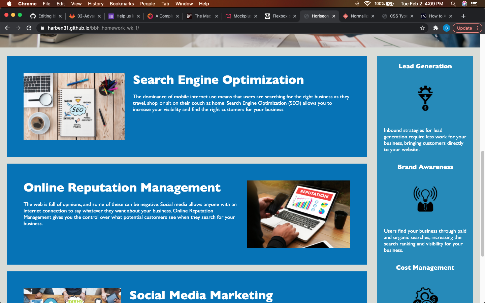
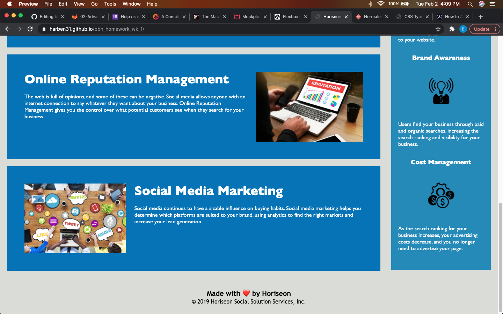

# bbh_homework_wk_1
# Refactor accessibility assignment

In this assignment we were to refactor the existing HTML and CSS for accessibility and optimization. My changes are noted with comments within each document but I will also give a brief review of the work I did. In the HTML doc I changed all the div elements to their apporpriate semantic elements and eliminated all unnessesary class's. I also added alts to the images in the main section In those alts I tried to use the words or phrase of that section so the site would be more visible in a search for that topic. In the CSS I consolidated a lot of redundant code and organized the rule sets to better match the HTML doc. I changed most of the selctors from .class selector to descendant selectors using tags.

Deployed application: https://harben31.github.io/bbh_homework_wk_1/

